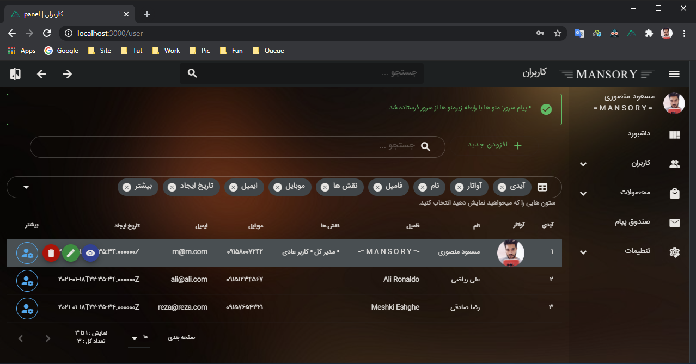
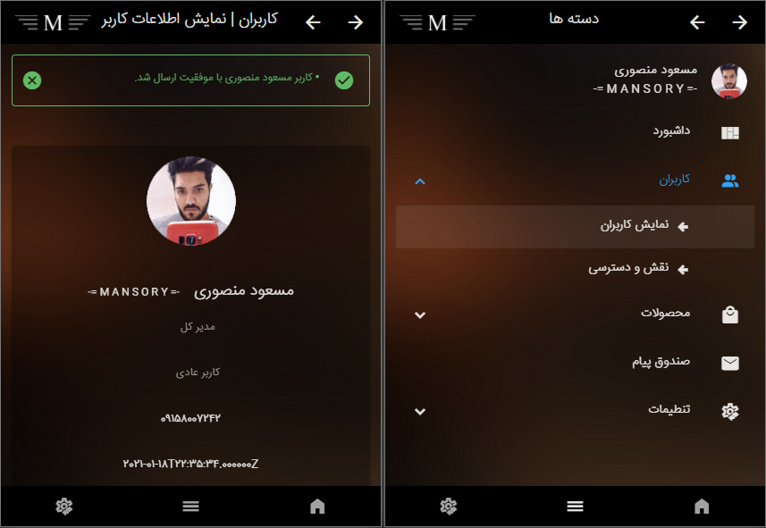

 
 -= پنل ادمین با لاراول و ناکست جی اس و ویوتی فای =- 

  
 
نسخه دسکتاپ

 

  
 
نسخه موبایل

 

## 
نمایش دمو

<a href="https://nuxt.laranuxt.ir" target="_blank">نمایش دمو</a>

## 
راهنمای نصب

<a href="https://www.youtube.com/playlist?list=PLXChBR5rCkrheZRydB6C-ohLMGL1Q6gGz" target="_blank">آموزش تصویری در کانال یوتیوب</a>

اگر توسعه دهنده هستید می توانید پروژه را فورک کنید و کانتری بیوت کنید تا از کدهای شما هم دیگران بتوانند استفاده کنند

این پنل بدون سرور هیچ استفاده ای ندارد شما باید پروژه لاراول داخل همین پیج گیت هاب را هم دریافت کنید و سرور رو ران کنید

بعد از دریافت باید یارن نصب یا ان پی ام نصب را اجرا کنید و فایل دات ای ان وی را بسازید و محتویات ای ان وی اگزمپل رو کپی کنید

خب امیدواریم که کارکند. درسته؟

## 
مجوز برنامه

<a href="https://opensource.org/licenses/MIT" target="_blank">MIT license </a>این پنل ادمین کد باز هست و تحت مجوز

